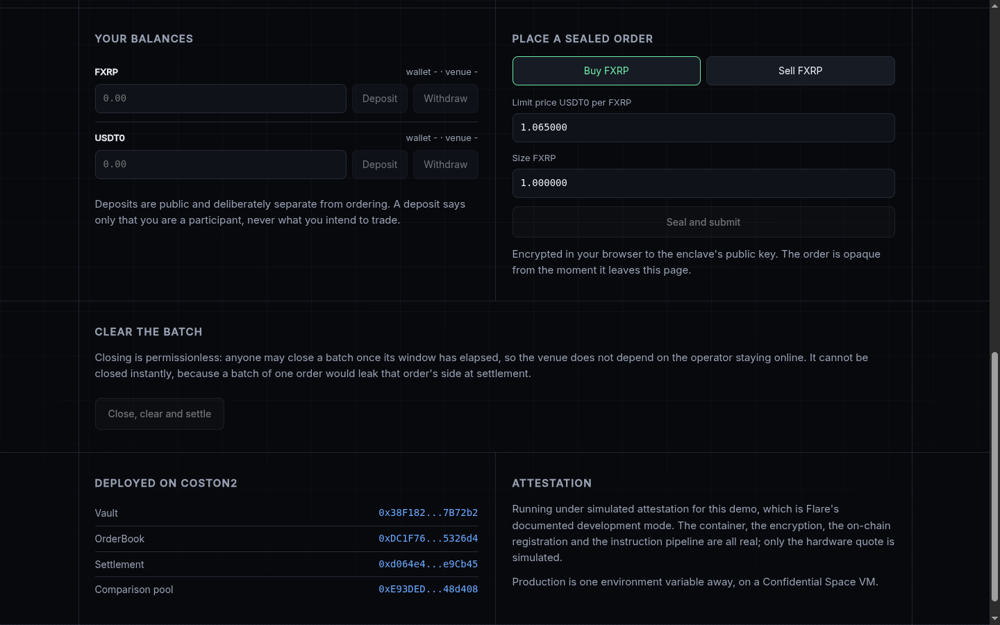

# Midpoint

A dark pool for FXRP. Orders are encrypted in the browser, matched inside a
Flare Confidential Extension at one uniform price, checked against the FTSO,
and settled on Coston2. The chain only ever sees ciphertext, a clearing
price, and net movements.

**Live:** https://major101x.github.io/midpoint/ ·
**Demo video:** [docs/submission.mp4](docs/submission.mp4)



## Why

Every trade on a public chain announces itself before it executes. This repo
measures what that costs rather than asserting it: `NaiveAmm.sol` is a
deliberately ordinary constant-product pool, deployed on Coston2, and
[client/scripts/sandwich.mjs](client/scripts/sandwich.mjs) runs the same
trade down both paths.

```
                                public pool         sealed venue
visible before it fills         yes                 no
price depends on order size     yes                 no, one clearing price
checked against an oracle       no                  yes, FTSO band
cost of being observed          747 bps             0 bps
```

Stable at 746-747 bps across five consecutive runs. Nothing in the pool is
broken; the leak is the venue's shape, which is why a better AMM is not the
answer and a sealed batch auction is.

## How it works

```
browser ──ECIES──> OrderBook.sol ──FCC instruction──> Confidential Extension
   seal              ciphertext                          decrypt, match,
                     only                                sign (EIP-191)
                                                              │
vault balances <── Settlement.sol <──untrusted relayer── signed result
                   signer == pinned enclave
                   next unsettled batch only
                   fills net to zero
                   price inside FTSO band
```

The order book exists only in enclave memory. Everyone in a batch clears at
the same price, so being early buys nothing and there is nothing to run
ahead of. Full mechanism, threat model and scope: [spec.md](spec.md).

## The map

| Where | What |
|---|---|
| [SUBMISSION.md](SUBMISSION.md) | The hackathon submission: bounties, measurements, addresses, scope table, roadmap |
| [spec.md](spec.md) | Design and plan: mechanism, architecture, threat model, cut lines |
| [PROGRESS.md](PROGRESS.md) | Day-by-day build log: what is deployed, live measurements, every failure and its fix |
| [design.md](design.md) | The interface's design system, with measured contrast and the reasoning |
| [contracts/](contracts/) | Vault, OrderBook, Settlement, NaiveAmm. Foundry; 88 tests |
| [extension/](extension/) | The Confidential Extension (TypeScript matching engine) inside Flare's FCE scaffold; the scaffold's own [README](extension/README.md) covers registration and services. 93 tests |
| [client/](client/) | ECIES order sealing, relayer, and the operational scripts (demo, sandwich, settle, pause-machines). 13 tests |
| [web/](web/) | The trading interface; [web/README.md](web/README.md) covers running it against the local stack |
| [media/](media/) | The explainer videos, rendered deterministically frame by frame; [media/README.md](media/README.md) explains how and why |
| [docs/](docs/) | Finished videos, stills, and the unedited demo capture with its log |

## Coston2 deployment

| Contract | Address |
|---|---|
| Vault | `0x38F182C65415C9bBCA03420E256E8A9E957B72b2` |
| OrderBook | `0xDC1F76dD480EE9A3B4383a29a1C956E11E5326d4` |
| Settlement | `0xd064e426F10a8DC00E9892722c468C8A41e9Cb45` |
| NaiveAmm (comparison baseline) | `0xE93DED1D2a9501Ad47F493a17a2BB1411148d408` |

Extension id 65944. Enclave identity keys are ephemeral by design, so
Settlement binds to the machine pinned per batch rather than to a fixed
signer. Verified constants live in [spec.md](spec.md) section 3.

## Running a batch yourself

With the enclave stack up (see [web/README.md](web/README.md) for bring-up):

```bash
cd client
./node_modules/.bin/vite-node scripts/demo.mjs
```

Deposits, seals two orders, waits out the batch window, closes, relays the
enclave's signed result, settles, and prints the conservation check. The
sealing of new orders needs the enclave running; everything already settled
is permanently verifiable on Coston2 regardless.

## Honest status

Built solo inside the Flare Summer Signal window; the repo started empty on
2026-07-30 and the commit history is the record. Fourteen sealed batches
settled on Coston2 at last count, plus one voided through the designed
recovery path after an enclave restart. Simulated TEE (Flare's FCC development mode), Coston2 only,
one pair; every cut line is stated in [SUBMISSION.md](SUBMISSION.md).
